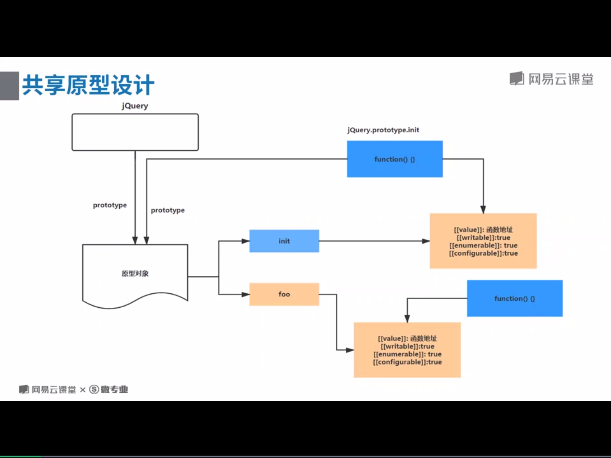

# jQuery设计思路

### jQuery 无new构建示例
$就是jQuery的别称;
````javascript
(function(root){
    var jQuery =function(){

    }
    root.$ = root.jQuery = jQuery
})(this)
````
$() 就是在创建jQuery的示例对象
````JavaScript
(function(root){
    var jQuery =function(){
        return new jQuery()
    }
    root.$ = root.jQuery = jQuery;
})(this)
````
### 共享原型设计

````JavaScript
(function(root){
    var jQuery = function(){
        return new jQuery.prototypoe.init()
    }
    jQuery.fn = jQuery.prototype = {
        init:function(){

        }
        //拓展其他方法
        css:function(){

        }
    }
    /共享原型对象
	jQuery.fn.init.prototype = jQuery.fn;
    root.$ = root.jQuery = jQuery;
})(this)
````
### extend源码解析
#### 应用场景
````javaScript
// 可以给jQuery本身进行拓展 此时的this === jQuery
$.extend({
    work:function(){}
})
//执行
jQuery.work()
//也可以给jQuery实例化对象进行拓展  this == jQuery 的实例化对象
$.fn.entend({
    sex:男
})
$().sex//打印出 男  $.fn.extend  === $.extend

//也可以对对象进行拓展 
//浅复制
var obj = $.extend({},{name:'max',list:{age:30}})
console.log(obj)//打印出obj对象
//进行深度复制
var ret = {name:"max",list:{age:"30"}};
var res = {list:{sex:"女"}};
//任意对象扩展
var obj1 = $.extend(true,{}, ret, res);       //=>  name  age
console.log(obj1);  
````
####jQuey的源码解析
````javaScript
(function(root){
    var jQuery = function(){
        return new jQuery.prototype.init()
    }
    jQuery.fn = jQuery.prototype = {
        init:function(){},
        css:function(){}
    }
    // $.fn.extend  === $.extend
    jQuery.fn.extend = jQuery.extend = function(){
        var target = arguments[0]||{};//判断extend方法传入的第一个参数 可能是 true 也可能是传入要拓展的对象
        var length = argument.length;//3
        var i =1;
        var deep = false;
        //定义变量
        var option,name,copy,src,copyIsArray,clone;
        //判断第一个参数 是否是boolean
         if (typeof target === "boolean") {
        	deep = target;
            target = arguments[1];//拓展成空对象 {} $.extend(true,{}, ret, res);      
			i = 2;
        }
        //如果 参数的个数是1
        if(length === i){
            target = this//给jQuery拓展属性和方法 target指向jQuery 或者jQuery实例化对象
            i--;
        }
        for(;i<length;i++){
            if( (option = ) ){

            }
        }
        //浅拷贝  深拷贝
		for (; i < length; i++) {
			if ((option = arguments[i]) != null) {
				for (name in option) {
					copy = option[name];
					src = target[name];
					if(deep && (jQuery.isPlainObject(copy) || (copyIsArray = jQuery.isArray(copy)))){
						if(copyIsArray){
							copyIsArray = false;
							clone = src && jQuery.isArray(src) ? src : [];
						} else {
							clone = src && jQuery.isPlainObject(src) ? src : {};
						}
						target[name] = jQuery.extend(deep, clone, copy);
					} else if(copy != undefined){
						target[name] = copy;
					}
				}
			}
		}
		return target;
    }
    //共享原型对象
    jQuery.fn.init.prototype = jQuery.fn;
    //给jQuery拓展类型的检测
    jQuery.extend({
        //类型检测
		isPlainObject: function(obj){
			return toString.call(obj) === "[object Object]";
		},
		isArray: function(obj){
			return toString.call(obj) === "[object Array]";
		}
    })
    root.$ = root.jQuery = jQuery;
})(this)

````
**工作中应用拓展深复制和浅复制的方法 去除传递一个参数的可能 **

````JavaScript

//浅复制
var obj = extend({},{nama:'max',list:{age:30}})
console.log(obj)
//深复制
var obj1 = extend(true,{},{name:'max',list:{age:30}},{list:{address:'北京'}})

//定义一个方法 用于拓展对象或者数组 
function extend(){
    var target = arguments[0] || {};
		var length = arguments.length;
		var i = 1;
		var deep = false;
		var option, name,copy,src,copyIsArray,clone;
        if (typeof target === "boolean") {
        	deep = target;
			target = arguments[1];
			i = 2;
        }
		if (typeof target !== "object") {
			target = {};
		}
	
		//浅拷贝  深拷贝
		for (; i < length; i++) {
			if ((option = arguments[i]) != null) {
				for (name in option) {
					copy = option[name];
					src = target[name];
					if(deep && (isPlainObject(copy) || (copyIsArray = isArray(copy)))){
						if(copyIsArray){
							copyIsArray = false;
							clone = src && isArray(src) ? src : [];
						} else {
							clone = src && isPlainObject(src) ? src : {};
                        }
                        //进行递归
						target[name] = extend(deep, clone, copy);
					} else if(copy != undefined){
						target[name] = copy;
					}
				}
			}
		}
		return target;
}
function isPlainObject(obj){
    return toString.call(obj) === "[object Object]";
}
function isArray(obj){
    return toString.call(obj) === "[object Array]";
}
````