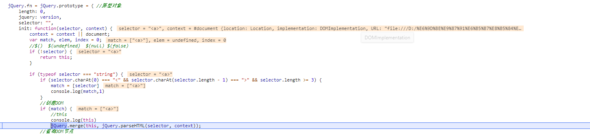
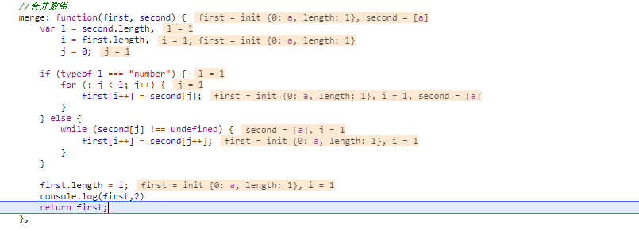
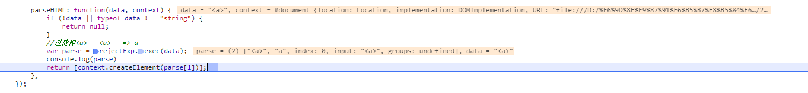

# 选择器

* 常用的jQuery选择器接口

* 选择器接口源码解析

> jQuery对象和DOM对象区别

DOM对象 | jQuery对象 
------------ | ------------- 
是由宿主环境提供的对象.在文档对象模型中,每个部分都是节点 如:所有的HTML元素节点,而element对象表示HTML元素    | jQuery构造函数创建出来的对象 通过jQuery选择器可以获取HTML的元素,并且以一种类数组的形式存储在jQuery对象中

> 错误的用法与对象转换

`````JavaScript
//错误用法示例代码
$('div').innerHTML
//错误用法示例代码
document.getElementsByTagName('div')[0].html()
//Element对象转换成jQuery对象
var domObj = document.getElementById('id');
var $obj - $(domObj);//jQuery对象
//jQuery对象转换成Element对象
var $box = $('.box')
var box = $box[0]
`````

> 常用的jQuery选择器接口

````javaScript
//传入对象
$(this)
$(document)
把传入的对象包装成jQuery对象
//传入函数
$(function(){})
这个是在也买你DOM文档加载完成后在家执行的,等效于在DOM加载完毕后执行$(document).ready()方法
//传入字符串
$(".box")
查找DOM节点包装成jQuery对象
//空
$()
创建jQuery对象
````


>jQuery示例对象length属性的作用

> merge方法的应用场景有哪些

> $(document).ready() 于$(function(){})的关系

````html
<!DOCTYPE html>
<html>
	<head>
		<meta charset="utf-8">
		<title></title>
	</head>
	<body>
		<div id="box"></div>
		<script src="jQuery.1.0.1.js"></script>
		<script>
          console.log($("<a>"))  //创建DOM
		  console.log($("#box")) //查找
		  console.log($(document))//创建 
		</script>
	</body>
</html>
````
> 如何把创建的DOM节点包装成jQuery对象?



````JavaScript
// 调用$("<a>") 其实实在调用  jQuery的init方法
(function(root) {
	var testExp = /^\s*(<[\w\W]+>)[^>]*$/;
	var rejectExp = /^<(\w+)\s*\/?>(?:<\/\1>|)$/;   
	var version = "1.0.1";
	var jQuery = function(selector, context) { 
		return new jQuery.prototype.init(selector, context);
	}

	jQuery.fn = jQuery.prototype = { //原型对象
		length: 0,
		jquery: version,
		selector: "",
		init: function(selector, context) {
			context = context || document;
			var match, elem, index = 0;
			//$()  $(undefined)  $(null) $(false)  
			if (!selector) {
				return this;
			}

			if (typeof selector === "string") {
				if (selector.charAt(0) === "<" && selector.charAt(selector.length - 1) === ">" && selector.length >= 3) {
					match = [selector]
					console.log(match,1)
				}
				//创建DOM
				if (match) {
					//this  
					console.log(this)
					jQuery.merge(this, jQuery.parseHTML(selector, context)); 
                //查询DOM节点
				} else {
					elem = document.querySelectorAll(selector);
					var elems = Array.prototype.slice.call(elem);
					this.length = elems.length;
					for (; index < elems.length; index++) {
						this[index] = elems[index];
					}
					this.context = context;
					this.selector = selector;
				}
			} else if (selector.nodeType) {
				this.context = this[0] = selector;
				this.length = 1;
				return this;
			}

		},
		css: function() {
			console.log("di~~didi~~")
		},
		//....
	}

	jQuery.fn.init.prototype = jQuery.fn;


	jQuery.extend = jQuery.prototype.extend = function() {
		var target = arguments[0] || {}; 
		var length = arguments.length;
		var i = 1;
		var deep = false; //默认为浅拷贝 
		var option;
		var name;
		var copy;
		var src;
		var copyIsArray;
		var clone;

		if (typeof target === "boolean") { 
			deep = target;
			target = arguments[1]; 
			i = 2;
		}

		if (typeof target !== "object") {
			target = {};
		}

		if (length == i) {
			target = this;
			i--; //0   
		}
 
		for (; i < length; i++) {
			if ((option = arguments[i]) !== null) {
				for (name in option) {
					src = target[name]; 
					copy = option[name];
					if (deep && (jQuery.isPlainObject(copy) || (copyIsArray = jQuery.isArray(copy)))) {
						if (copyIsArray) { 
							copyIsArray = false;
							clone = src && jQuery.isArray(src) ? src : [];
						} else { 
							clone = src && jQuery.isPlainObject(src) ? src : {};
						}
						target[name] = jQuery.extend(deep, clone, copy);
					} else if (copy !== undefined) {
						target[name] = copy; 
					}
				}
			}
		}
		return target;
	}


	jQuery.extend({
		//类型检测     
		isPlainObject: function(obj) {
			return typeof obj === "object";
		},

		isArray: function(obj) { 
			return toString.call(obj) === "[object Array]";
		},

		isFunction: function(fn) {
           return toString.call(fn) === "[object Function]";
		},
		//类数组转化成正真的数组  
		markArray: function(arr, results) {
			var ret = results || [];
			if (arr != null) {
				jQuery.merge(ret, typeof arr === "string" ? [arr] : arr);
			}
			return ret;
		},

		//合并数组
		merge: function(first, second) {
			var l = second.length,
				i = first.length,
				j = 0;

			if (typeof l === "number") {
				for (; j < l; j++) {
					first[i++] = second[j];
				}
			} else {
				while (second[j] !== undefined) {
					first[i++] = second[j++];
				}
			}

			first.length = i;

			return first;
		},

		parseHTML: function(data, context) {
			if (!data || typeof data !== "string") {
				return null;
			}
			//过滤掉<a>   <a>   => a 
			var parse = rejectExp.exec(data);
			console.log(parse)
			return [context.createElement(parse[1])];   
		},
	});

	root.$ = root.jQuery = jQuery;
})(this);
````

