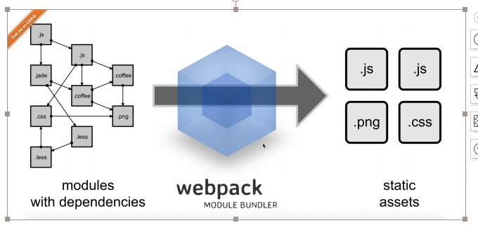
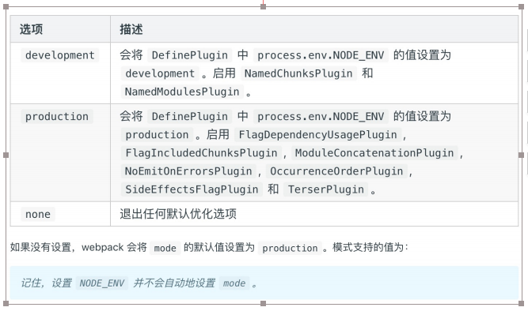

# webpack
**webpack打包工具**
**Webpack可以看做是模块打包工具:分析项目结构,找到javaScript模块以及其他的一些浏览器不能直接运行的拓展语言(Scss,TypeScript登),并将其打包成合适的格式以供浏览器的使用**

[Webpack官网](https://www.webpackjs.com/concepts/)

### Webpack 的安装


* 环境:[nodeJs](http://nodejs.cn/api/) 

* 全局安装
````
npm install webpack webpack-cli -g//webpack-cli 可以帮助我们
在命令⾏⾥使⽤npx ,webpack等相关指令
webpack -v
npm uninstall webpack webpack-cli -
````

* 局部安装 项⽬内安装
````
    npm install webpack webpack-cli --save-dev // -D
````
* 安装指定版本

````
    npm info webpack //查看webpack 的历史发布的信息
    npm install webpack@X.xx webpack-cli -D
````

* 检查安装是否成功

````
    webpack -v \// command not found 默认在全局中进行查找
    npx webpack -v //npx 帮助我们在项目中的node_modules 里面进行查找webpack
    ./node_modules/.bin

````


## Webpack 配置文件
**因为另配置是很弱的,特定的需求,需要自建进行配置**

````javaScript
    module.export ={
        entry:"./src/index/js",//默认的入口文件
        output:"./dist/main.js"//默认的输出文件
    }

````

当我们使用npx webpack,表示使用webpack处理打包,./src/index.js为入口模块.打包后的模块名称是main.js 
webpack默认的配置文件叫 webpack.config.js可以对该文件进行个性化配置

* 使用默认配置文件
````
    npx webpack//执行命令后 webpack会找到默认的配置文件 并使用执行
````
* 不适用默认的配置文件 webpack.config.js
````
    npx webpack --config webpack.config.js //指定webpack使用 webpackconfig.js文件作为配置文件并执行
````
* 修改package.json scripts字段:   在模块局部安装会在node_modules/.bin目录下创建一个软连接
````JavaScript
"scripts":{
    "test": "echo \"Error: no test specified\" && exit 1",
    "dev": "webpack"
}
npm run dev
````
### Webpack.config.js配置结构
````javaScript
const path = require("path");
module.export={
    entry:"./src/index.js",//打包入口文件
    output:{
        path: path.resolve(__dirname, "./dist"),
        filename:"main.js"
    },//输出结构
    mode: "development",//开发环境 production:打包环境
    module:{
        rules:[
            //loader模块处理
            {
                test:"\.css",
                use:"style-loader"

            }
        ]
    },
    plugins:[new HtmlWebpackPlugin()]//对插件的配置
}
````

##项目结构优化

````
    dist
        //  打包后的资源目录
    src //源代码
        css
        images
        index.js
    package.json
    webpack.config.js        
````

## Webpack 的核心概念
**entry:指定webpack打包入口文件:Webpack执行构建的第一步将Entry开始,表示输入的文件**
````JavaScript
    //单页面入口文件
    entry:{
        main:"./src/index.js"
    }
    ===相当于简写===
    entry:"./src/index.js"
    //多页面入口文件
    entry:{
        index:"./src/index.js",
        login:"./src/login.js"
    }
````
## output:
>打包转换后的文件输出到磁盘位置:输出结构,在Webpack经过一系列处理并得到最终想要的代码输出结果
````JavaScript
//单输出文件配置
output:{
    filename:"main.js",//输出文件的而名称
    path:path.resolve(__dirname:"dist")//输出文件到磁盘目录 必须是绝对路径
}
//多输出文件配置
output:{
    filename:"[name][chunkhash:8].js",//利用占位符,文件名称不要重复
    path:path.resolve(__dirname,"dist")//s输出文件到磁盘的目录,必须是绝对路径
````
## mode
>Mode用来指定当前的构建环境

* production
* development 
* null 
> 设置mode 可以自动出发webpack内置的构造函数,以达到最有的效果



### loader
>模块解析,模块转换器,用于把模块原内容按照需求转换成新的内容

**webpack是模块打包工具,而模块不仅仅是js,也可能是css,图片或者其他格式 但是webpack默只知道如何处理js和json模块,那么其他格式的模块处理就需要loader**
g
>常见的loader
````
    style-loader
    less-loader
    scss-loader
    ts-loader//将ts转换成js
    babel-loader// 转换ES6\7等新的特性语法
    file-loader//处理图片
    eslint-loader
    ...
````
### moudle
**在webpack里面一切皆是模块,一个模块对应一个文件,Webpack会从配置的Entry开始递归找出所有的依赖模块**
````javaScript
module:{
    rules:[
        {
            test:/\.xxx$/,//指定匹配的规则
            use:{
                loader:"xxx-load"//指定使用的loader
            }
        }
    ]
}
````

**当webpack处理不认识的模块时,需要在webpack中的module处进行配置,当检测到是什么格式的模块,就会使用什么loader来处理**\

* loader:file-loader: 处理静态资源模块
> 原理是把打包入口中识别出的资源模块,移动到输出目录,并且返回一个地址名称

>使用场景:当我们需要模块,仅仅是从源代码挪移到打包目录,就可以使用file-loader来处理,txt,svg,csv,excel,图片资源等
````
npm install file-loader -D
````
>案例
> //webpack.config.js 相关图片webpack的配置
````JavaScript

module:{
    rules:[
        {
            test:/\.(png|jpe?g|gif)$/,
            //use 使用一个loader可以用对象,字符串,两个loader需要用数组
            use:{
                loader:"file-loader",
                //options额外的配置,比如资源名称
                options:{
                    //placeholder 占位符 [name]老资源的模块名称 [ext]老资源模块的后缀名
                    name:"[name]_[hash].[ext]",
                    //打包后存放的位置
                    outputPath:"images/",
                    piblickPath:"../images"
                }
            }
        }
    ]
}
````
> index.js 图片文件的引入

````JavaScript
import logo from "./logo.png";

var img = new Image();
img.src = logo;
img.classList.add("logo");//添加类名
var root = document.getElementById("root");
root.append(img);
````


> 添加字体
[阿里巴巴字体连接](https://www.iconfont.cn/webfont#!/webfont/index)

> index.css
````css
@font-face {
  font-family: "webfont";
  font-display: swap;
  src: url("webfont.woff2") format("woff2");
}

body {
  background: red;
  font-family: "webfont" !important;
  font-size: 20px;
}

````
> webpack.cofig.js

````JavaScript
 {
        test: /\.(woff2|woff)$/,
        use: {
          loader: "file-loader"
        }
      },
````
* url-loader

**url-loader内部使用了file-loader,所以可以处理file-loader所有的事情,但是碰到jpg格式的模块,会把图片转换成base64格式的字符串,并打包到js里面,对于体积下的图片比较合适,但是大图片不合适**

> 案例
````javaScript
module:{
    rules:[
        {
            test:/\.(png|jpe?g|gif)$/,
            use:{
                loader:"url-loader",
                options:{
                    name:"[name].png",
                    outputPath:"images/",
                    //小于2048,才转换成base64
                    limit:2048
                }
            }
        }
    ]
}
````

## 文件监听
**轮询判断文件最后编译的时间是否发生了变化,当某个文件发生变化,,并不会告诉立刻告诉监听者,先缓存起来**

> webpack开启监听模式,有两种

* 启动webpack命令时,带上--watch 参数,启动监听后,启动监听后需要手动刷新浏览器
````JavaScript
scripts:{
    "watch":"webpack --watch"
}
````
* 在配置文件里设置watch:true
````JavaScript
watch: true, //false
watchOptions: {
    //默认为空，不监听的文件或者目录，支持正则
   ignored: /node_modules/,
    //监听到文件变化后，等300ms再去执行，默认300ms,
    aggregateTimeout: 300,
    //判断文件是否发生变化是通过不停的询问系统指定文件有没有变化，默认每秒问1次
    poll: 1000//ms
    }
````

### 样式处理
**css-loader分析css模块生成内容,以style挂载到页面的header部分**
````
npm install style-loader css-loader -D
````
> webpack.config.js
````JavaScript
{
    test:/\.css$/,
    use:["style-loader","css-loader"]
}
````

### Less样式处理

> less-loader把less语法转换成css

````
npm install less less-loader --save-dev
````
> webpack.config.js 进行配置
````JavaScript
{
    test:/\.scss$/,
    use:["style-loader","css-loader","less-loader"]
}
````

### 样式自动添加后缀名

````
npm i prostcss-loader autoprefixer -D
````
> 案例
````JavaScript
{
  test: /\.less$/,
  use: [
    'style-loader',
    'css-loader',
    'less-loader'
    {
      loader: 'postcss-loader',
      options: {
        ident: 'postcss',
       plugins: [
            require("autoprefixer")({
            overrideBrowserslist: ["last 2 versions", ">1%"]
        })
  ]
      }
    }
  ]
}
````
> 新建postcss.config.js
````JavaScript
module.exports = {
  plugins: [
    require("autoprefixer")({
      overrideBrowserslist: ["last 2 versions", ">1%"]
    })
  ]
};
````
> webpack.config.js
````JavaScript
 {
        test: /\.less$/,
        use: [
          MiniCssExtractPlugin.loader,
          "css-loader",
          "less-loader",
          "postcss-loader"
        ]
      }
````

## Plugins

**plugin可以在webpack运行到某个阶段的时候,帮你做一些事前,类似生命周期概念**
**拓展插件,在Webpack构建流程中的特定时机注入扩展的逻辑来改变构建结果或者你想要做的事情**
**作用于整个构建过程**

### HtmlWebpackPlugin

> HtmlWebpackPlugin会在打包结束后,自动生成一个html文件,并把打包生成的js模块引入到html中

````
npm install --save-dev html-webpack-plugin
````

>配置

元素 | 功能
------------ | ------------- 
title | 用来生成页面title元素
filename|输出Html文件名,默认是index.html,也可以直接配置带有的子目录
template|模板文件路径,支持加载器,比如 html !./index.html
inject| true header body false,注入所有的资源到特定的template或者templateContent中,如果设置为true或者bady所有的javaScript资源放置到body元素的底部,'head'将防止head元素中
favicon| 添加特定favicon路径到输出的HTML文件中
minify| 传递html-minifier选项mimify输出
hash| true or false 默认是true 错误信息会写到html页面中
cache|true or false 默认值是true,仅仅在文件修改之后才会发布文件
showErrors| true or false 默认是true 错误信息会写到页面html中
chunks| 允许添加某些模块(比如, unit test等)
chunksSortMode| 允许控制酷块添加到页面之前的排序方式 'none' 'defalut' '{function}-default:'auto'' 
excludeChunks|允许跳过某些块,{比如跳过单元测试}

> 案例
````JavaScript
const path = require("path");
const HtmlWebpackPlugin = require("html-webpack-plugin");
 plugins: [
    new HtmlWebpackPlugin({
      title: "首页",
      template: "./src/index.html",
      inject: true,
      chunks: ["index"],
      filename: "index.html"
    }),
  
  ]

````html
<!DOCTYPE html>
<html lang="en">
  <head>
    <meta charset="UTF-8" />
    <meta name="viewport" content="width=device-width, initial-scale=1.0" />
    <meta http-equiv="X-UA-Compatible" content="ie=edge" />
    <title>首页</title>
  <link href="index_359eebac.css" rel="stylesheet"></head>
  <body>
    <div id="root"></div>
  <script type="text/javascript" src="index_fc32eaab.js"></script></body>
</html>

````

### clean-webpack-plugin
> 永凯清除文件 

````
npm install --save-dev clean-webpack-plugin
````
````JavaScript
const { CleanWebpackPlugin } = require("clean-webpack-plugin");
  plugins: [
    new CleanWebpackPlugin(),
  ]

````

### mini-css-extract-plugin

````javaScript
const MiniCssExtractPlugin = require("mini-css-extract-plugin");
module:{
    rules:[
        {
        test: /\.less$/,
        use: [
          MiniCssExtractPlugin.loader,
          "css-loader",
          "less-loader",
          "postcss-loader"
        ]
      }
    ]
}
plugins:[
    new MiniCssExtractPlugin({
      filename: "[name]_[contenthash:8].css"
    })
]
````

### souseMap
> 源代码与打包后的代码的映射关系


### wwebpackDevServer


