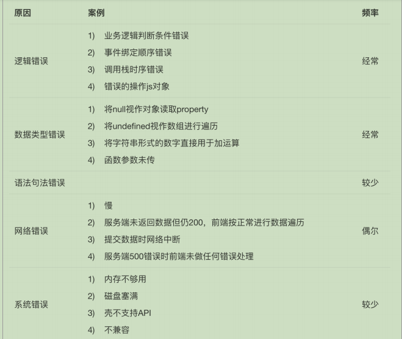

# 项目启动
## 功能模块
1. 用户
    1. 登录
    2. 注册
    3. 验证码(阿里云) 4. 关注
2. 文章
    1. 增删改查
    2. 评论
    3. 点赞
3. 问答
    1. 增删改查
    2. 回复
    3. 顶踩
## 前端技术选型

1. 团队现状
2. 上手
3. 生态
4. 先验证

5.  

功能 | element | Iview | 
------------ | ------------- | --------- |
组件| ★★★★★ | ★★★★★
npm|
issue|
团队人数|
按需加载|
国际化|
admin|

https://www.zhihu.com/question/57118065 ☆☆☆

## 后端技术选型

功能 | element | Iview | 
------------ | ------------- | --------- |
npm|
gitHup| 
团队人数|
bug |
typeScript |
中文社区|
竞争力 | typescript依赖注入| 约定优于配置 内置多进 基于koa

## 数据库

Mongo VS mysql
mongo易用

## 前后端交互

数据mock （easy-mock）

jwt认证

axios 

阿里云人机验证

## 开发规范

1. 分支管理

    1、dev => test=> master
    2、Git hook （husky）
    3、
2. git信息规范

    1. https://github.com/eggjs/egg/commits/master
   ````
    <Header> <Body> <Footer>
   ````
    2.commitizen

3. npm script工作流
4. 代码规范 eslint
5. 目录规范
6. 注释+代码+测试 == 好文档 
     

## 统计
1. 百度统计
    1. 自定义
2. 谷歌统计

## 错误
1. 全局捕获。使用window.onerror
2. 主动上报。try/catch
3. sentry(免费够用) 
4. 错误通知机制



## 部署

. 代码变更

. 提交代码变更到远程版本库

. 程序通过测试

. 提升package.json中的版本

. 生成CHANGELOG

. 提交package.json和CHANGELOG.md文件

. 打上Tag

. 推送